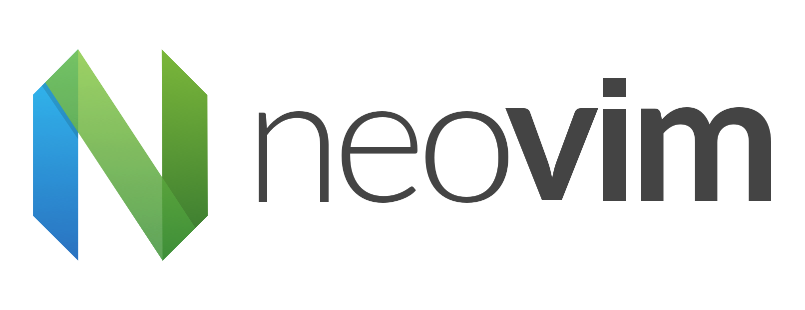

<div align="center">
<p>
    <a href="https://github.com/JannatinNaim/NeoVimConfig/pulse">
      
    </a>
    <a href="https://github.com/lunarvim/LunarVim/blob/main/LICENSE">
      
    <a href="https://twitter.com/intent/follow?screen_name=JannatinNaimJN">
      
    </a>
</p>
</div>

> Custom NeoVim configuration for a rich Vim experience. This configuration uses Vim-Plug as it's plugin manager and has native lsp support for popular languages. Custom key-maps are set for better navigation along with intelligent code completion.

## Install Command

```bash
git clone https://github.com/JannatinNaim/NeoVimConfig ~/.config/nvim
```

After cloning the repository, you must install the CoC Extensions with the following command.

```bash
chmod +x ~/.config/nvim/scripts/coc_extension_install.sh && ~/.config/nvim/scripts/coc_extension_install.sh
```

## Plugin List

The plugins used in this config are as follows.

-   OneDark
-   CoC
-   AirLine
-   Ranger
-   Commentary
-   Colorizer
-   Rainbow Parentheses
-   FzF
-   Startify
-   Git
-   WhichKey

## Resources

-   [GitHub](https://github.com/JannatinNaim/NeoVimConfig)
